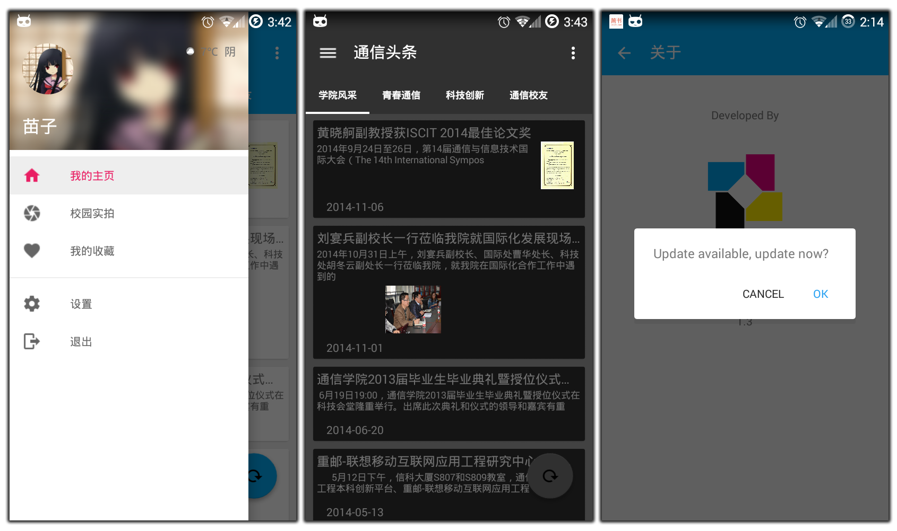

#nmid-headline
--------
[中文用户点这里！](note/readme_chs.md)

This is a android feeds client for CQUPT. And it's a material design demonstrate as well :)

####Features
* Full Material Design
* RESTful API Design
* Translucent mode for kitkat or higher
* Local CSS in WebView
* Night mode supported
* Check for update supported

####Download
Downloads are avaliable on

* [Wandoujia Store](http://www.wandoujia.com/apps/cn.edu.cqupt.nmid.headline) 
* [Tencent Store](http://sj.qq.com/myapp/detail.htm?apkName=cn.edu.cqupt.nmid.headline)  
* [360 Store](http://zhushou.360.cn/detail/index/soft_id/2781053?recrefer=SE_D_%E9%80%9A%E4%BF%A1%E5%A4%B4%E6%9D%A1)  
* [Baidu Store](http://shouji.baidu.com/software/item?docid=7599338&from=as)  
* [91 Store](http://apk.91.com/Soft/Android/cn.edu.cqupt.nmid.headline-206-2.06.html)
* [Hiapk Store](http://apk.hiapk.com/appinfo/cn.edu.cqupt.nmid.headline/206)  

####Build Environment
Android Studio 1.1 or higher

####License
MIT
